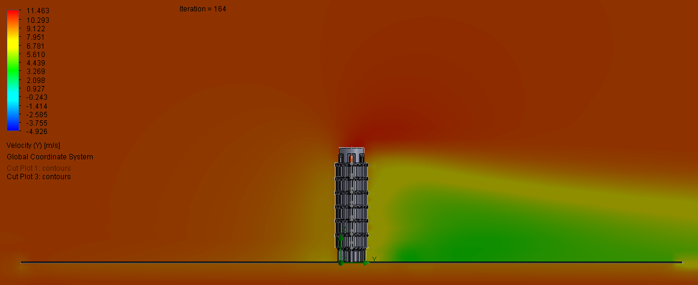

# Leaning Tower of Pisa — SolidWorks Model & Flow Simulation

A 3D CAD model of the Leaning Tower of Pisa, built in **SolidWorks** and analyzed with **SolidWorks Flow Simulation** to study how air flows around the structure. The tower is modeled as three distinct sections — a base, a repeating mid-tier, and a crown — that assemble into the building's characteristic tilt, then placed in a virtual wind tunnel to visualize the surrounding velocity field.

> _Originally built for a Visual Dynamics midterm, then cleaned up and documented as a portfolio project._

## Overview

The goal was to recreate the Leaning Tower faithfully enough to behave realistically in a flow analysis: the tiered, arcaded body, the narrowing crown, and the signature lean. Rather than modeling the tower as one monolithic part, it was broken into reusable sections — an approach that keeps the geometry manageable and lets the repeating mid-levels be reused instead of redrawn. The completed model was then run through a CFD-style flow simulation to see how wind moves around and behind the structure.

## Flow Simulation Results

A wind-tunnel flow simulation was set up with the tower on a ground plane and air driven across it. The cut plots below show the **velocity field** around the structure — warm colors are higher-velocity freestream flow, cooler colors mark the low-velocity wake.

*Velocity cut plot: airflow accelerates around the tower while a distinct low-velocity wake forms downstream.*

*Velocity (Y-component) cut plot with an extended ground domain, ranging roughly from −4.9 to 11.5 m/s, showing the near-ground wake trailing off the structure.*

## Modeling Approach

The tower was constructed in three sections that combine to form the full edifice:

- **Base section** — the lowest portion of the tower closest to the ground, developed across several modeling iterations to get the tiered, columned profile right.
- **Middle section** — a single mid-tier part duplicated to build up the repeating central body of the tower.
- **Top / crown section** — the narrower bell-chamber piece that caps the structure.

A reference photo (`Leaning_Tower_Reference.png`) was used to match the proportions and the angle of the lean.

## Skills Demonstrated

- **Part modeling** of complex, multi-feature geometry (tiered arcades, columns, the leaning profile)
- **Sectional/modular design** — splitting a structure into reusable, separately modeled parts
- **SolidWorks Flow Simulation** — setting up a flow domain, running the solve, and interpreting velocity cut plots
- **Engineering visualization** — producing result plots and an animation to communicate the analysis

## Repository Contents

| File | Description |
| --- | --- |
| `2026-03-11-Pisarev-MidtermAttempt2*.SLDPRT` | Base / lower tower section (modeling iterations) |
| `2026-03-12-Pisarev-MidtermMiddlePart.SLDPRT` | Repeating mid-tier section |
| `2026-03-12-Pisarev-MidtermTopPart.SLDPRT` | Crown / top section |
| `Leaning_Tower_Reference.png` | Reference photo used for proportions |
| `VelocityResult1.png` | Flow simulation — velocity field cut plot |
| `VelocityResultBiggerGround.png` | Flow simulation — velocity-Y cut plot (extended domain) |
| `Animation 1.avi` | Animation of the model / simulation |

## Viewing the Files

The `.SLDPRT` part files require **SolidWorks** to open. If you don't have SolidWorks, the simulation images above and the animation show the work without it.

> **Note:** GitHub won't preview `.avi` files inline — they have to be downloaded to watch. Converting `Animation 1.avi` to an `.mp4` or `.gif` (and renaming it without the space, e.g. `animation.gif`) would let it play or embed directly in this README.
